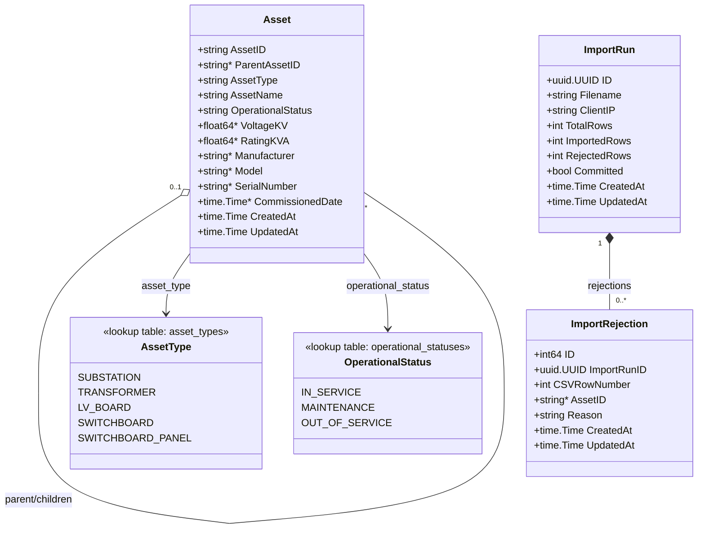

# Architecture & Technical Decisions — Smart Grid & Asset Management

This document is the technical backbone of the submission: schema, API
contract, the validation algorithm (the part actually being graded most
heavily), frontend structure, testing strategy, and every place a judgment
call was made instead of a spec being followed literally. Anything marked
**[ASSUMPTION]** should also land in your architecture/trade-off note and,
where relevant, `KNOWN_LIMITATIONS.md`.

---

## 1. System overview

```
                 ┌────────────────────┐
   Browser  ───▶ │  frontend (nginx)  │
                 │  React + TS (SPA)  │
                 └─────────┬──────────┘
                            │ /api/*  (reverse-proxied)
                            ▼
                 ┌────────────────────┐
                 │  backend (Go)      │
                 │  HTTP API          │
                 └─────────┬──────────┘
                            │ GORM (pgx)
                            ▼
                 ┌────────────────────┐
                 │  PostgreSQL 16     │
                 └────────────────────┘
```

- Frontend never talks to Postgres directly — only to the Go API, over
  `/api/*`, which nginx proxies to the `backend` container on the compose
  network. This satisfies "frontend communicates only with your backend API." nginx also proxies the
  open `/swagger/*` and `/docs` pages, so the footer's "API docs" link works on the app's own origin.
- No user accounts, no RBAC — explicitly out of scope (section 8). Don't add a login
  screen "for realism"; it's ungraded surface area that just adds risk. **[ASSUMPTION]**
  At the owner's request the whole `/api` surface sits behind one shared key
  (`x-api-key`, see below); this is a shared secret, not authentication of users.
- **[ASSUMPTION]** Every request is stamped with a trace ID (an
  `X-Trace-Id` header, generated if the caller doesn't supply one) that
  flows through `context.Context` into every log line for that request.
  See `ASSUMPTIONS.md`'s `base/logs` entry for the full reasoning.

## 2. Data model

```sql
-- Shared trigger function: every table's updated_at is kept current by
-- one BEFORE UPDATE trigger per table (Postgres has no built-in
-- equivalent of MySQL's ON UPDATE CURRENT_TIMESTAMP).
CREATE FUNCTION set_updated_at()
RETURNS TRIGGER AS $$
BEGIN
    NEW.updated_at = now();
    RETURN NEW;
END;
$$ LANGUAGE plpgsql;

-- Lookup tables replace the old native asset_type/operational_status
-- ENUM types: adding a new type/status later is a plain seed-row
-- INSERT, not an ALTER TYPE/schema migration. Natural-key PK (the code
-- itself), matching assets.asset_id — no surrogate id, no translation
-- layer between an int id and the string codes used throughout the
-- API/CSV.
CREATE TABLE asset_types (
    code        TEXT PRIMARY KEY,
    created_at  TIMESTAMPTZ NOT NULL DEFAULT now(),
    updated_at  TIMESTAMPTZ NOT NULL DEFAULT now()
);

CREATE TRIGGER trg_asset_types_set_updated_at
    BEFORE UPDATE ON asset_types
    FOR EACH ROW EXECUTE FUNCTION set_updated_at();

INSERT INTO asset_types (code) VALUES
    ('SUBSTATION'),
    ('TRANSFORMER'),
    ('LV_BOARD'),
    ('SWITCHBOARD'),
    ('SWITCHBOARD_PANEL');

CREATE TABLE operational_statuses (
    code        TEXT PRIMARY KEY,
    created_at  TIMESTAMPTZ NOT NULL DEFAULT now(),
    updated_at  TIMESTAMPTZ NOT NULL DEFAULT now()
);

CREATE TRIGGER trg_operational_statuses_set_updated_at
    BEFORE UPDATE ON operational_statuses
    FOR EACH ROW EXECUTE FUNCTION set_updated_at();

INSERT INTO operational_statuses (code) VALUES
    ('IN_SERVICE'),
    ('MAINTENANCE'),
    ('OUT_OF_SERVICE');

-- Permitted child->parent type pairs (brief section 3), a table instead
-- of hardcoded Go constants for the same scalability reason as
-- asset_types/operational_statuses. A type with no row here
-- (SUBSTATION) is a root type and must have no parent at all — see
-- pass 2, rule 1 below.
CREATE TABLE asset_type_parent_rules (
    child_type_code   TEXT NOT NULL REFERENCES asset_types(code) ON UPDATE CASCADE,
    parent_type_code  TEXT NOT NULL REFERENCES asset_types(code) ON UPDATE CASCADE,
    created_at        TIMESTAMPTZ NOT NULL DEFAULT now(),
    updated_at        TIMESTAMPTZ NOT NULL DEFAULT now(),
    PRIMARY KEY (child_type_code, parent_type_code)
);

CREATE TRIGGER trg_asset_type_parent_rules_set_updated_at
    BEFORE UPDATE ON asset_type_parent_rules
    FOR EACH ROW EXECUTE FUNCTION set_updated_at();

INSERT INTO asset_type_parent_rules (child_type_code, parent_type_code) VALUES
    ('TRANSFORMER', 'SUBSTATION'),
    ('LV_BOARD', 'SUBSTATION'),
    ('SWITCHBOARD', 'SUBSTATION'),
    ('SWITCHBOARD_PANEL', 'SWITCHBOARD');

CREATE TABLE assets (
    asset_id            TEXT PRIMARY KEY,
    parent_asset_id     TEXT REFERENCES assets(asset_id),
    asset_type          TEXT NOT NULL REFERENCES asset_types(code) ON UPDATE CASCADE,
    asset_name          TEXT NOT NULL,
    operational_status  TEXT NOT NULL REFERENCES operational_statuses(code) ON UPDATE CASCADE,
    voltage_kv          NUMERIC,
    rating_kva          NUMERIC CHECK (rating_kva IS NULL OR rating_kva >= 0),
    manufacturer        TEXT,
    model               TEXT,
    serial_number       TEXT,
    commissioned_date   DATE,
    created_at          TIMESTAMPTZ NOT NULL DEFAULT now(),
    updated_at          TIMESTAMPTZ NOT NULL DEFAULT now()
);

CREATE TRIGGER trg_assets_set_updated_at
    BEFORE UPDATE ON assets
    FOR EACH ROW EXECUTE FUNCTION set_updated_at();

CREATE INDEX idx_assets_parent       ON assets (parent_asset_id);
CREATE INDEX idx_assets_type         ON assets (asset_type);
CREATE EXTENSION IF NOT EXISTS pg_trgm;
CREATE INDEX idx_assets_name_trgm    ON assets USING gin (asset_name gin_trgm_ops);
CREATE INDEX idx_assets_id_trgm      ON assets USING gin (asset_id gin_trgm_ops);

-- Audit trail for each upload, satisfying 4.2's "make it clear whether
-- data was committed."
CREATE TABLE import_runs (
    id              UUID PRIMARY KEY DEFAULT gen_random_uuid(),
    filename        TEXT NOT NULL,
    client_ip       INET NOT NULL,
    total_rows      INT NOT NULL,
    imported_rows   INT NOT NULL,
    rejected_rows   INT NOT NULL,
    committed       BOOLEAN NOT NULL,
    created_at      TIMESTAMPTZ NOT NULL DEFAULT now(),
    updated_at      TIMESTAMPTZ NOT NULL DEFAULT now()
);

CREATE TRIGGER trg_import_runs_set_updated_at
    BEFORE UPDATE ON import_runs
    FOR EACH ROW EXECUTE FUNCTION set_updated_at();

CREATE TABLE import_rejections (
    id              BIGSERIAL PRIMARY KEY,
    import_run_id   UUID NOT NULL REFERENCES import_runs(id) ON DELETE CASCADE,
    csv_row_number  INT NOT NULL,
    asset_id        TEXT,
    reason          TEXT NOT NULL,
    created_at      TIMESTAMPTZ NOT NULL DEFAULT now(),
    updated_at      TIMESTAMPTZ NOT NULL DEFAULT now()
);

CREATE TRIGGER trg_import_rejections_set_updated_at
    BEFORE UPDATE ON import_rejections
    FOR EACH ROW EXECUTE FUNCTION set_updated_at();
```

**[ASSUMPTION]** `asset_type` and `operational_status` are lookup tables
(`asset_types`/`operational_statuses`, natural-key `code TEXT PRIMARY
KEY`), not native Postgres `ENUM` types — for scalability: adding a new
type or status later is a plain seed-row `INSERT`, not an `ALTER TYPE`/
schema migration. The `assets` table keeps the same FK column names
(`asset_type`, `operational_status`) and still stores the same string
codes, so the API/CSV contract and the Go `AssetType`/`OperationalStatus`
const types are unchanged. Trade-off: validation never queries the
database per row, so the CSV validator checks membership
against an in-memory/cached set loaded from these tables (e.g. at
startup), not a live per-row query — see `KNOWN_LIMITATIONS.md`.

**[ASSUMPTION]** The permitted parent-type pairs (brief section 3) live
in `asset_type_parent_rules` (`child_type_code`, `parent_type_code`,
both FKs into `asset_types`) rather than hardcoded Go constants, for the
same scalability reason. A type with no row as a child (`SUBSTATION`) is
a root type and must have no parent. Enforcement is unchanged from the
prior design: the Go backend still walks this at import time via an
in-memory cache, not a live query or a DB trigger/constraint — see the
hierarchy-enforcement `[ASSUMPTION]` below.

**[ASSUMPTION]** Every table has `created_at` and `updated_at`, the
latter kept current by one shared `set_updated_at()` trigger function
reused per-table (Postgres has no built-in `ON UPDATE
CURRENT_TIMESTAMP`). This includes `import_rejections`, an append-only
audit table with no update code path today — the trigger exists for
schema-wide uniformity, not because an update is expected.

**[ASSUMPTION]** `import_runs.client_ip` (`INET NOT NULL`) stands in for
a user id, since this app has no auth/user system to attribute an
import to. The import handler derives it from the
last `X-Forwarded-For` hop (trusting nginx as the sole in-path proxy),
falling back to `RemoteAddr`. This is informational/audit-only, not a
security control: `docker-compose.yml` also publishes the backend's port
directly to the host, so a caller hitting the backend directly bypasses
nginx entirely and can set an arbitrary `X-Forwarded-For` with nothing
to strip or verify it. See `KNOWN_LIMITATIONS.md`.

**[ASSUMPTION]** Hierarchy *enforcement* (parent existence, type-pairing,
cycle detection, cascading rejection) stays in the **application layer**
at import time, not a DB trigger/constraint, even though the permitted
*pairs* now live in `asset_type_parent_rules`. A DB-level trigger is
possible but adds real complexity for checks only ever exercised through
the write paths this app has (CSV import and deleting one childless asset; no edit),
and validation never queries the database per row, so these
pairs are read into an in-memory cache, not queried live per row. A raw
`INSERT` against the DB could bypass these checks, but nothing in this
system does raw inserts outside the import path.

### Domain model (Go)

`backend/internal/entity/model` mirrors the tables above as GORM-tagged
structs, each with a `TableName()`, and carries the helpers that project a
model onto its API shape (`Asset.ToSummary`, `ImportRun.ToResponse`, …). No
JSON tags, no business rules (see the package doc comment). The two lookup
tables have tiny models of their own (`AssetType`, `OperationalStatus`) so
no table name is spelled out in the repository.
`AssetType` and `OperationalStatus` are plain `string`s — there are no Go
constants for the permitted values. The lookup tables are the single
source of truth: `service.LookupCache` loads them into an immutable
in-memory snapshot (at startup and again at the start of every import),
and validation reads that snapshot, so adding a type, status or parent
pairing is a data change with no redeploy. `*` marks a nullable/pointer
field.



## 3. API contract

| Method | Path | Purpose |
|---|---|---|
| `POST` | `/api/imports/preview` | multipart CSV upload (field `file`) → two-pass validation → outcome and a fingerprint; **writes nothing** |
| `POST` | `/api/imports` | multipart CSV upload (field `file`, optional `expected_fingerprint`) → two-pass validation again → the valid rows are committed in one transaction (412 if the fingerprint no longer matches) |
| `GET`  | `/api/imports` | import activity: past imports, newest first, paged |
| `GET`  | `/api/imports/template` | downloadable CSV template (header generated from the importer's column table, plus example rows) |
| `GET`  | `/api/imports/{importId}` | re-fetch a past import's result summary |
| `GET`  | `/api/lookups` | asset types, operational statuses and parent-type pairings validation runs against |
| `GET`  | `/api/assets` | every asset, paged, filterable by `q`, `type`, `status` and sortable by `sort` (`asset_id`, `name`, `type`, `status`, `parent`) and `dir`; sorted in SQL from a fixed column list, so it orders every page; ties by id, roots last when sorting by parent |
| `GET`  | `/api/assets/stats` | counts by asset type and by operational status |
| `GET`  | `/api/assets/roots` | all top-level (parent-less) assets, for initial tree render |
| `GET`  | `/api/assets/{assetId}` | one asset's details |
| `DELETE` | `/api/assets/{assetId}` | delete one asset; 409 if it still has children |
| `GET`  | `/api/assets/{assetId}/children` | immediate children, grouped by type, with sub-tree counts |
| `GET`  | `/api/assets/{assetId}/ancestors` | ordered path root → asset (drives "expand to reveal ancestors") |
| `GET`  | `/api/assets/search?q=&type=&limit=` | partial/exact match on id or name, optional type filter |

**Access.** Every `/api` endpoint requires the shared `API_KEY` as the `x-api-key` header
(`middleware.RequireAPIKey` on the `/api` route group, after the rate limiter): 401 if it is
missing or wrong, 403 if the server has no key configured (fails closed). `/healthz`, `/docs` and
`/swagger/*` are open. The frontend never holds the key: nginx (and the Vite dev proxy) add it to
every proxied `/api` request.

Every endpoint is documented in the generated OpenAPI spec
(`backend/docs/`, served at `/swagger/index.html`, `doc.json`,
`swagger.yaml`; regenerate with `make docs`). The spec is the reference
for exact field names, nullability and status codes — this section
records the decisions behind it.

`POST /api/imports` response shape. A commit stores the rows that pass
and skips the rest (section 4): `committed` is true when at least one row was
stored, `imported_rows + rejected_rows = total_rows`, and `rejections[]` lists
every skipped row, including rows skipped because their parent was rejected.
`POST /api/imports/preview` returns the same numbers (`importable_rows` instead of
`imported_rows`) plus a `fingerprint`, and stores nothing.

Every row stored:

```json
{
  "import_id": "uuid",
  "total_rows": 222,
  "imported_rows": 222,
  "rejected_rows": 0,
  "committed": true,
  "rejections": []
}
```

Some rows skipped (the rest were stored; `committed` is `false` only when nothing was):

```json
{
  "import_id": "uuid",
  "total_rows": 222,
  "imported_rows": 214,
  "rejected_rows": 8,
  "committed": true,
  "rejections": [
    { "csv_row": 178, "asset_id": "TX-NR", "reason": "rating_kva cannot be negative (-500)" },
    { "csv_row": 183, "asset_id": "SWB-CY-A", "reason": "cycle detected: SWB-CY-A -> SWB-CY-B -> SWB-CY-A" }
  ]
}
```

**[ASSUMPTION]** Import response details beyond the two examples above:

- `ignored_columns` (array, always present) lists header columns the
  importer does not recognise. They are skipped, not stored, and not an
  error. It is only reported on the upload response (`GET
  /api/imports/{id}` returns `[]` — it is not persisted).
- Both outcomes (`committed` true or false) are `200` with the same
  shape, and carry `Location: /api/imports/{id}`; `committed` is the
  discriminator. A file that cannot be processed at all gets a 4xx
  `ErrorResponse` (`{"error", "line"?, "trace_id"?}`): `400` no file /
  empty file, `413` over `MAX_REQUEST_BYTES`, `415` not `.csv`, `422`
  malformed CSV (with `line`), header missing a required column, or no
  data rows, `409` another import changed the stored data concurrently.
  Unexpected failures are a generic `500` with only a `trace_id`; the real
  error is in the server log under the same id.
- A rejection's `reason` lists **every** problem on the row, joined with
  `"; "`, so a row can be fixed in one pass.

**[ASSUMPTION]** Response shapes for the read endpoints (the brief only
fixes what each returns, not the JSON):

- `AssetSummary`: `asset_id, parent_asset_id (null at the top), asset_type,
  asset_name, operational_status`. `AssetDetail` adds `voltage_kv,
  rating_kva, manufacturer, model, serial_number, commissioned_date
  (YYYY-MM-DD), created_at, updated_at`; nullable columns are `null`.
- `AssetNode` = summary + `rating_kva` and `commissioned_date` (nullable; so
  the children list can be sorted by them without a request per row, which is
  done client-side because the whole child set is already loaded) +
  `child_count` (immediate children) + `subtree_count` (assets in its subtree **including itself**; a leaf is 1).
- `GET /api/assets/roots` → `{total, roots: AssetNode[]}`. "Roots" means
  assets with no parent — which pass 2 rule 1 guarantees are exactly the
  root types — so no type name is hardcoded.
- `GET /api/assets/{id}/children` → `{asset_id, total_children, groups:
  [{asset_type, count, subtree_count, assets: AssetNode[]}],
  descendant_counts: [{asset_type, count}]}`. Groups are sorted by type
  code, assets by id. `descendant_counts` is every descendant by type
  ("counts per type beneath a substation"). A childless asset returns empty
  lists, not `404`.
- `GET /api/assets/{id}/ancestors` → `{asset_id, path: AssetSummary[]}`,
  top of the hierarchy first, **the asset itself last**.
- `GET /api/assets/search` → `{query, type, count, truncated, results}`.
  `q` is required (1–200 chars); `type` is matched case-insensitively
  against the lookup table (`400` if unknown); `limit` defaults to 50, max
  200. Matching is a case-insensitive substring on id or name with `%`/`_`
  taken literally; exact id first, then id prefix, then by id.
- Unknown `assetId` → `404` on `{id}`, `/children` and `/ancestors`.
- Unknown path → `404 {"error": "not found"}`; wrong verb → `405
  {"error": "method not allowed"}` with an `Allow` header. Routes answer `GET`
  (or `POST` for the upload) only — there is no implicit `HEAD`.

**[ASSUMPTION]** All JSON request/response keys use `snake_case`, not
`camelCase` — a deliberate, explicit choice (not Go's default `json:`
tag behavior, which would otherwise be PascalCase from exported struct
fields). Every handler must set explicit `json:"snake_case_name"` tags;
don't rely on field-name defaults.

**[ASSUMPTION]** A structurally invalid upload — wrong extension, an
empty file, or content that isn't decodable as CSV at all (ragged rows,
bad quoting, non-UTF-8, or a header too narrow to plausibly be
comma-delimited) — never reaches the `ImportResponse` shape above. It's
rejected before either validation pass runs, with a plain 4xx
`{"error": "..."}` body (`dto.ErrorResponse`), the same shape every
other endpoint's error path uses. `rejections[]` is reserved for a file
that parses structurally but has semantically-bad rows (section 4); a
caller must not expect `committed`/`total_rows`/etc. on a structural
failure. See `base/csvx` (`docs/ASSUMPTIONS.md`) for the layer that
draws this line.

`csv_row` is the **original** row number from the uploaded file (1-indexed,
including header), not the row's position after any reordering — this is
what makes the rejection report actually useful for someone fixing the
source data.

## 4. Validation algorithm (the graded core)

CSV row order must not determine validity, and a child can appear before
its parent in the same file — so this cannot be a single top-to-bottom
pass. Two passes:

**Pass 1 — field-level, per row, independent of everything else:**
`asset_id`/`asset_type`/`asset_name`/`operational_status` present;
`asset_id` unique within the file; `asset_type` and `operational_status`
are members of the permitted sets (the lookup snapshot, matched
case-insensitively and stored as the canonical code); `voltage_kv`/
`rating_kva` parse as finite numbers and `rating_kva >= 0`;
`commissioned_date` parses. Rows failing here are rejected immediately and
excluded from pass 2 — a row with a garbage `asset_type` can't
meaningfully participate in a hierarchy check anyway.

**[ASSUMPTION]** Pass 1 details the brief leaves open: a blank
`operational_status` is "missing required field" (the column is
`NOT NULL`); `commissioned_date` accepts `YYYY-MM-DD`, `D/M/YYYY` and `D/M/YY`,
read day-first (the supplied data has many values with a day above 12 and none
with a month above 12; 2-digit years follow Go's pivot, 00–68 → 20xx, 69–99 → 19xx); when an `asset_id` appears on
several rows, **every** occurrence is rejected, naming the other rows
(`duplicate asset_id "X" (also on rows 5, 9)`) — nothing says which one is
authoritative.

**Pass 2 — hierarchy, over the full candidate set (DB-existing IDs ∪
pass-1-surviving file IDs):**
1. SUBSTATION must have no parent; everything else must have one.
2. An asset cannot parent itself.
3. The parent must exist in that combined ID set (DB or file).
4. The parent's type must be a permitted parent for the child's type
   (the lookup table in section 3 of the brief).
5. **Cycle detection**: build a directed child→parent graph restricted to
   rows that passed checks 1–4, then walk each node's ancestor chain
   with a per-walk visited-set; revisiting a node means every node in
   that revisited cycle is rejected.
6. **[ASSUMPTION]** Cascading rejection: if a node's own row is valid but
   its parent was rejected (for any reason, including transitively), the
   child is also rejected with reason `"ancestor <id> was rejected"`
   rather than silently attached to nothing or promoted to a fake root.
   This isn't explicitly stated in the brief — document it as the
   reasonable reading of "ultimately resolve to a substation root." The
   `<id>` is the nearest ancestor rejected *in its own right* (the root
   cause), so the message does not depend on the order rows appear in.

**[ASSUMPTION]** Two Pass 2 refinements to the list above:

- **Rule 0 — already stored:** a file row whose `asset_id` already exists in
  the database is rejected (`asset_id "X" already exists in the database`).
  The alternative (upsert) would allow re-parenting a stored asset into a
  cycle through database rows, and "no CRUD beyond import" argues against
  it. Consequence: re-uploading a file that already committed rejects every
  row. Two imports racing past this check are settled by the primary key —
  the loser gets `409`, and nothing is half-written.
- **Cycle detection runs over every in-file parent link**, not only rows
  that passed checks 1–4. Type rules are acyclic (a switchboard can only sit
  under a substation), so a cycle such as `SWB-CY-A ↔ SWB-CY-B` can never
  pass the parent-type check; restricted to rows passing 1–4 it would be
  unreachable and always mislabelled "wrong parent type". A cycle member's
  reason leads with the cycle (`cycle detected: A -> B -> A`) and then
  appends any other problem the row has.

**Import outcome — [ASSUMPTION]: check → review → confirm, then commit the valid
rows.** The brief permits all-or-nothing or partial. The first design was
all-or-nothing, but the supplied `grid_assets.csv` (222 rows) contains about 17
deliberately bad rows, so it would have committed nothing. The flow is now two
steps, which leaves the choice to the user instead of to a global policy:

1. `POST /api/imports/preview` runs both passes against the current data and
   returns the counts, every rejection and a fingerprint. It writes nothing:
   no assets, no `import_runs` row, no locks.
2. The user either cancels (fixes the file) or confirms. `POST /api/imports`
   sends the same file, with the fingerprint, and validates **again**: the
   backend never trusts a client-supplied outcome. In one transaction it inserts
   the accepted rows (parents first) plus the `import_runs`/`import_rejections`
   audit rows. Rejected rows and anything under a rejected parent are skipped;
   `committed = imported_rows > 0`.

The fingerprint is a SHA-256 over every cell of the file, the ids that would be
stored and every rejection, so it changes if the file or the stored data changes
in a way that alters the outcome. On a mismatch the commit is refused with **412**
and nothing is written; the UI re-checks the file and shows the new result. The
remaining window between the second validation and the INSERT is closed by the
database: a primary-key or foreign-key violation aborts the transaction and is
answered with **409**. There is no staging table: the browser keeps the file, and
re-uploading it (capped at `MAX_REQUEST_BYTES`) avoids server-side state, expiry and
cleanup. A caller that omits `expected_fingerprint` (curl, tests) simply commits the
valid rows directly. Existing assets are never updated: a row whose `asset_id` is
already stored is rejected as a duplicate.

### 4.1 Flexible columns and rows — nothing is hardcoded

- **Columns are found by header name, never by position.** Headers are
  normalised (trim, BOM, case, and runs of space/`-`/`_` fold together:
  `Asset ID` = `asset_id`). Any column order works; unknown columns are
  ignored and echoed back as `ignored_columns`; optional columns may be
  absent from the file entirely (only the four `NOT NULL` fields must be
  present). A missing required column or a repeated known column is a `422`
  naming the columns found. There is no fixed column count — the minimum
  passed to `csvx` is derived from the schema.
- **The schema is one declarative table** (`service/import.go`,
  `assetFields`): name, required-ness, and a check/apply pair per column.
  Header resolution, required checks, parsing and validation all iterate it;
  adding a column means adding one entry (plus its model field and DB column).
- **Values come from the database, not from code.** Permitted asset types,
  statuses and parent pairings — including which types are "root" (those with
  no parent rule) — are read from the lookup tables via `LookupSnapshot`.
- **Rows are unbounded by design.** No row count is assumed anywhere; the
  only ceiling is the upload size (`MAX_REQUEST_BYTES`, default 10 MiB).
  Fully blank rows (Excel's trailing `,,,,`) are skipped and not counted.
  Ragged rows (wrong field count) stay a structural `422` naming the line:
  an unquoted comma inside a value would otherwise silently shift every
  later column and corrupt data.
- Real-world file handling: UTF-8 BOM, CRLF, quoted multi-line cells and
  surrounding whitespace are all handled; `csv_row` stays the true file line.

### 4.2 Concurrency

Go's concurrency is used where it pays, and deliberately not elsewhere:

| Where | How | Why |
|---|---|---|
| Import pre-validation reads | `errgroup`: lookup-table refresh ‖ "which of these ids already exist" | independent I/O, overlapped |
| Pass 1 | chunked worker pool (`base/parallel`; 512 rows/chunk, ≤ `GOMAXPROCS`); each worker writes disjoint indices of a pre-sized slice, so output order is deterministic and needs no lock; panics in workers become errors; honours request cancellation | CPU-bound, rows independent |
| `GET .../children` | `errgroup`: parent exists ‖ children with counts ‖ descendant counts | three independent reads |
| Not used | pass 2, transactional insert, subtree counts, ancestors, search | pass 2 shares graph state and is a few map lookups per row; a transaction is one connection; one recursive CTE beats N per-child queries |

### 4.3 Observability of rejections

Every rejected row is logged (`Warn`, capped at 50 lines per import, then a
summary) with `import_id, file, line, asset_id, pass, reason`, and the same
`line`/reason is in the response, so an operator and a user look at the same
row. Structural failures log the CSV line too. Log values are quoted so
user-controlled text (filenames, cells) cannot forge log lines.

## 5. Frontend structure

- **Stack**: React + TypeScript + Vite, React Router, TanStack Query for
  server-state/caching. No Redux/Zustand — 220 assets and a handful of
  endpoints don't justify a global store; this is the "reasonable
  separation without unnecessary abstraction" line from section 5 of the
  brief.
- **[ASSUMPTION]** Typography is Inter, self-hosted through `@fontsource/inter`
  (OFL-licensed), a clean stand-in for the reference site's proprietary
  typeface — see `docs/ASSUMPTIONS.md`'s "Frontend visual identity" section.
- **Routes**: `AppRoot` holds the client state and wraps two layout routes that
  share `AppShell` (top bar with search and an **Import** button on every page).
  `ExplorerLayout` adds the asset-tree rail (and its mobile drawer) for `/`
  (overview), `/assets` (all assets) and `/assets/:assetId` (stable route required by
  4.4 — direct nav and refresh must resolve the same asset, which the nginx
  `try_files ... /index.html` config already supports); only the main panel and the
  tree's expansion/selection differ. `PageLayout` has no rail and serves `/import`
  (upload, review and import history on one page); `/imports` redirects there.
  **[ASSUMPTION]** Import is a task page, not part of the explorer, so it has no tree.
- **Key components**: `ImportPage` = `ImportPanel` (upload card) with
  `ImportPreview` and `ImportResult` (review and final report under it) and `ImportHistory`, `AssetTree`/`AssetTreeNode`
  (recursive, children fetched on first expand, no virtualization needed at
  this scale), `AssetDetailsPanel`, `SearchBar` (ARIA combobox). `AppShell` also renders the footer: `AppVersion`
  (name, version from `package.json` injected at build as `__APP_VERSION__`, copyright) at the bottom of the tree
  rail and drawer, and `AppFooter` (links to the API docs, `/swagger/index.html`, and `/healthz`, plus a live clock in
  the browser's time zone) as the last element of the scrolling main panel; it is not fixed to the screen. Pages
  without a rail (Import) show the version at the left of `AppFooter`.
  One icon per asset type comes from `api/assetTypes.ts`. **[ASSUMPTION]** see `ASSUMPTIONS.md`.
- **Search → select flow**: search hit → `GET /assets/{id}/ancestors` →
  expand those tree nodes → navigate to `/assets/:id` → highlight →
  render details panel. This is the one piece of client state (which
  nodes are expanded) that's genuinely local UI state, not server state.
- **Loading/empty/error states** (explicitly required in 4.3): each panel
  needs its own skeleton/empty/error rendering, not just the page.
- **API types are generated, not hand-written.** `npm run generate:types`
  converts the backend's Swagger 2.0 spec (`backend/docs/swagger.json`) to
  OpenAPI 3 (`swagger2openapi`) and generates `src/api/schema.ts`
  (`openapi-typescript`); `src/api/types.ts` gives the schemas friendly names.
  The spec marks every response field required and pointer fields nullable
  (`x-nullable`), so the generated types match runtime shapes. The
  regeneration flow follows the reference project's.

## 6. Testing strategy

- **Backend, highest priority** (10% line item, but also what 4.1's 15%
  is really testing): table-driven unit tests for the validator, one case
  per rejection category — missing required field, duplicate ID, bad
  type, bad status, negative rating, substation-with-parent,
  orphan-without-parent, missing parent, self-parent, wrong-parent-type,
  and the cycle case. Use the seeded rows already in `grid_assets.csv` as
  your fixtures — you don't need synthetic data, the graders already
  built it for you.
- **Backend integration**: run against a real Postgres (the compose `db`
  service). `internal/testutil.NewTestDB` gives each test its own schema with
  the migrations applied and drops it afterwards, so tests are isolated,
  parallel-safe and never touch dev data. They run when `TEST_DATABASE_URL`
  is set and skip otherwise, so plain `go test ./...` still works anywhere.
  Covered: repository queries, commit vs. all-rejected behaviour, dynamic
  lookups, concurrent identical uploads, and the full HTTP stack through
  `router.New`. Pure logic (both passes, header resolution, ordering) is
  table-driven and DB-free; run everything with `-race`.
- **Swagger guards** (`router/swagger_test.go`, DB-free): every route
  registered in `router.New` is in the spec and vice versa, every `$ref`
  resolves, and the UI/spec are served without a key — so a route or
  DTO change without `make docs` fails a test, and the frontend types cannot
  silently drift from the API.
- **Request DTOs** (`dto.SearchRequest`, `dto.ImportIDRequest`) have
  table-driven `Validate()` tests; model → dto helpers have table tests
  beside the models. Repository tests stay integration tests on purpose:
  they are what proves the GORM builder and the recursive CTEs are correct,
  which a mock cannot.
- **Frontend**: lighter touch given the weighting — Vitest + React
  Testing Library on tree expansion and search-selects-and-highlights
  behavior is enough; skip exhaustive snapshot testing.

## 7. Infra

Containerized via the `docker-compose.yml` already provided: `db` →
`migrate` (one-shot, applies SQL migrations, must succeed before backend
starts) → `backend` → `frontend`. See that file's comments for detail. There is no CI/CD pipeline: the
build and run are local, and the commands are in `DEPLOYMENT.md` (**[ASSUMPTION]**, `ASSUMPTIONS.md`).
